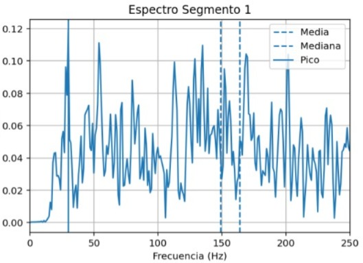
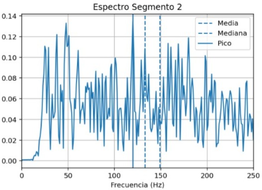
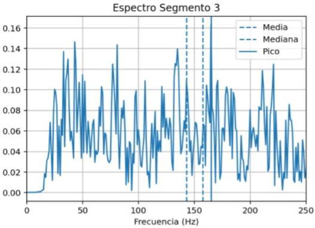
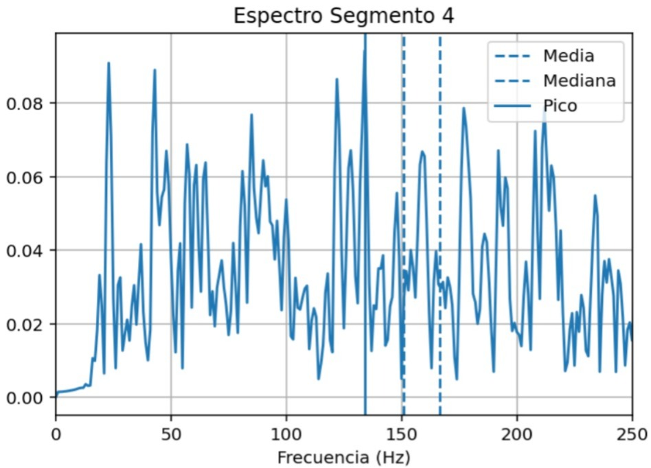
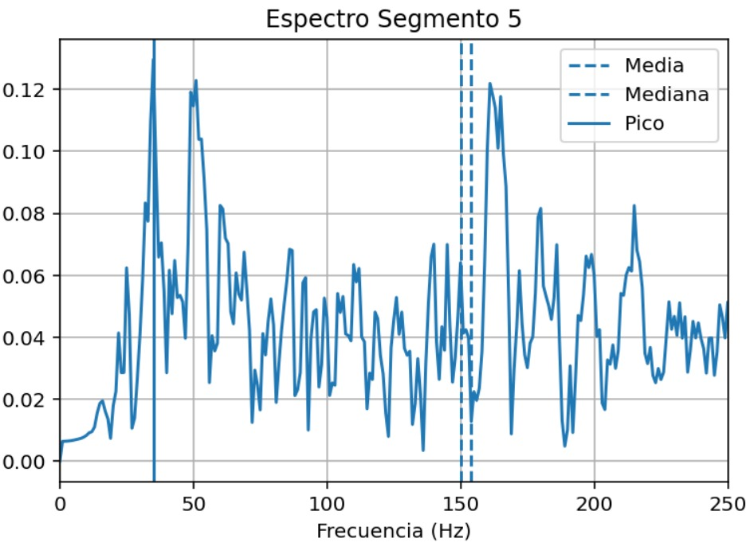
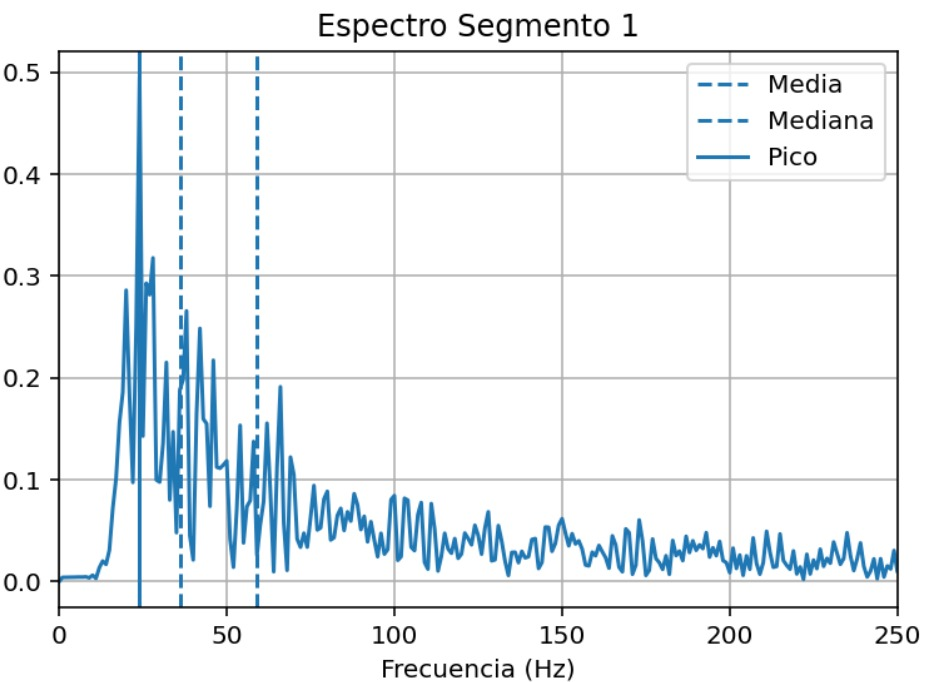
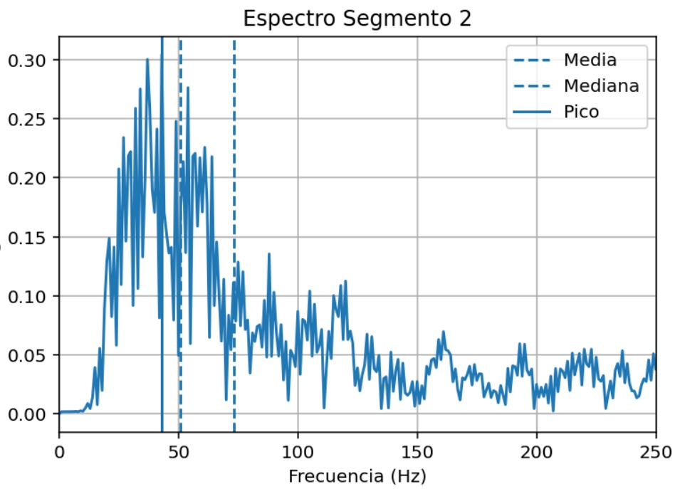
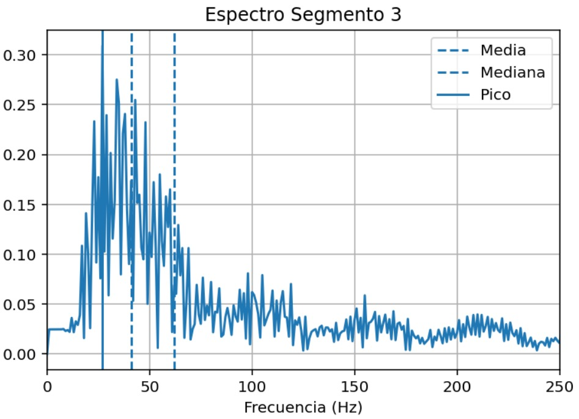
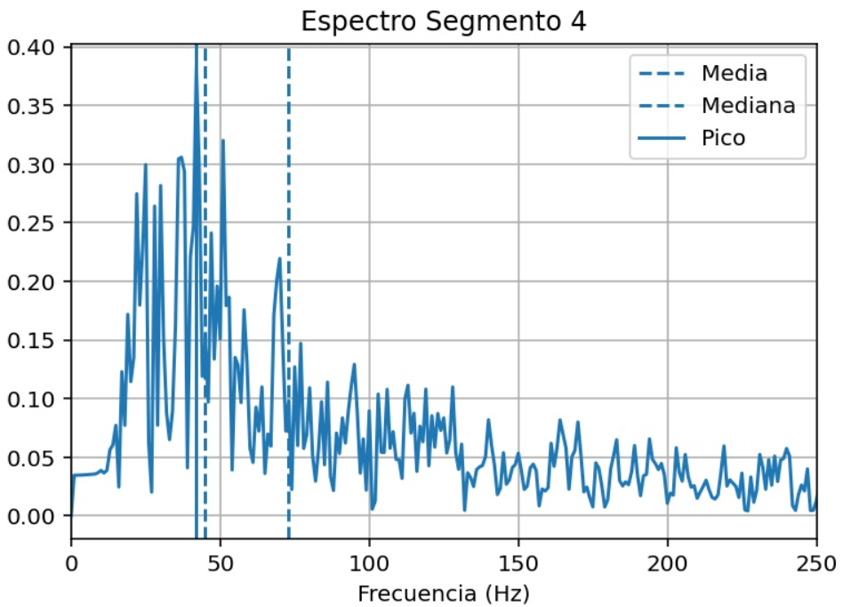
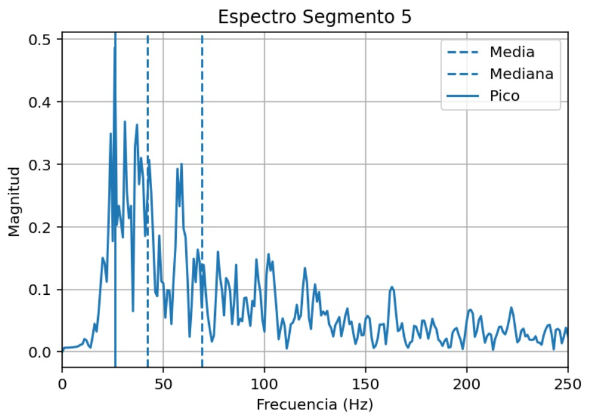

  
# Señales electromiográficas (EMG)
## Cuarto laboratorio de procesamiento digital de señales

**Maria Camila Ospina Jara, Juan Felipe Serna Alarcón**

## Descripción
Esta actividad consistió en la adquisición, acondicionamiento y procesamiento de señales electromiográficas. El propósito fue evaluar las variaciones en las características temporales y frecuenciales del músculo durante ejercicios controlados, utilizando tanto señales emuladas mediante un generador como señales reales capturadas de un voluntario. Se aplicaron técnicas de filtrado y segmentación para interpretar parámetros críticos como la frecuencia media y la frecuencia mediana
## Introducción
La fatiga muscular se define como la reducción de la capacidad del músculo para controlar cargas y mantener contracciones eficaces, fenómeno derivado de la acumulación de lactato y la disminución de adenosín trifosfato (ATP)
. Dado que un músculo fatigado presenta un mayor riesgo de lesiones, es fundamental su identificación objetiva
. En esta práctica, se utilizó la electromiografía de superficie (sEMG) como una técnica no invasiva para registrar la actividad eléctrica muscular
. El enfoque principal fue el empleo de herramientas de procesamiento digital de señales en los dominios del tiempo y la frecuencia para detectar cambios espectrales específicos que ocurren cuando el músculo alcanza el estado de fatiga

-------------------------------------------------------------------------------------------------------------------------
## Desarrollo de la práctica
### Parte A Captura y Análisis de Señal Emulada
En la primera fase, se utilizó un generador de señales biológicas configurado en modo EMG para simular cinco contracciones musculares voluntarias. Una vez adquirida la señal, se procedió a su segmentación para analizar cada contracción de forma individual. Se calcularon la frecuencia media y mediana para cada segmento, representando los resultados en tablas y gráficas de evolución. Esta etapa permitió observar cómo varían estos estadísticos en un entorno controlado antes de pasar a sujetos reales.

  

### Resultados obtenidos  
##### Tabla de frecuencias por contracción

  
|CONTRACCIÓN [-]     |FRECUENCIA MEDIA [Hz]     |FRECUENCIA MEDIANA [Hz]     |    
|:-----:|:-----:|:-----:|
|1     |254.95     |127.00     |     
|2     |255.56     |126.00     |          
|3     |253.80     |124.00     |          
|4     |251.23     |123.00     |          
|5     |249.48     |122.00     |                

##### Gráfica de la señal emulada por el generador de señales

  

-------------------------------------------------------------------------------------------
### Parte B Captura de Señal Real y Detección de Fatiga
Se realizó la captura de señales sEMG reales colocando electrodos de superficie sobre un grupo muscular (como el bíceps o antebrazo) de un voluntario sano. El sujeto realizó contracciones repetidas hasta alcanzar la fatiga o la falla muscular. Para asegurar la calidad de la señal, se aplicó un filtro pasa-banda de 20 a 450 Hz, eliminando ruidos y artefactos. La señal se dividió por contracciones, calculando nuevamente la frecuencia media y mediana para analizar su tendencia decreciente a medida que progresaba el esfuerzo, relacionando estos cambios con la fisiología de la fatiga.

  

### Resultados obtenidos  
#### - Contracción normal 
  
  
         

##### Tabla de frecuencias por segmento

  
|SEGMENTO [-]     |FRECUENCIA MEDIA (MNF) [Hz]     |FRECUENCIA MEDIANA (MDF) [Hz]     |FRECUENCIA PICO [HZ]  |  
|:-----:|:-----:|:-----:|:-----:|
|1     |164.12     |149.00     |30.00|     
|2     |149.06     |133.00     |120.00 |         
|3     |157.64     |143.00     |165.00  |        
|4     |166.70     |151.00     |134.00   |       
|5     |150.06     |154.00     |35.00   |

#### - Contracción en fatiga
    
  
  

##### Tabla de frecuencias por segmento

  
|SEGMENTO [-]     |FRECUENCIA MEDIA (MNF) [Hz]     |FRECUENCIA MEDIANA (MDF) [Hz]     |FRECUENCIA PICO [HZ]  |  
|:-----:|:-----:|:-----:|:-----:|
|1     |59.00     |36.00     |24.00|     
|2     |73.31     |51.00     |43.00 |         
|3     |61.64     |41.00     |27.00  |        
|4     |72.77     |45.00     |42.00   |       
|5     |68.84     |42.00     |26.00   |

--------------------------------------------------------------------
### Parte C Análisis Espectral mediante FFT
Finalmente, se aplicó la Transformada Rápida de Fourier (FFT) a cada contracción de la señal real para obtener el espectro de amplitud. Al comparar los espectros de las primeras contracciones con los de las últimas, se pudo identificar visual y numéricamente la reducción del contenido de alta frecuencia y el desplazamiento del pico espectral hacia las bajas frecuencias. Este análisis confirmó la utilidad de la FFT como herramienta diagnóstica para monitorear el esfuerzo sostenido y la fatiga muscular de manera objetiva.

  

### Análisis y discusión de resultados
- La fatiga muscular se produce principalmente por la acumulación de metabolitos como el lactato y la disminución de ATP, lo que reduce la capacidad del músculo para sostener contracciones eficientes. En términos de señal sEMG, este fenómeno se refleja en la disminución del contenido de altas frecuencias, el desplazamiento del espectro hacia bajas frecuencias y la reducción progresiva de la frecuencia media y mediana. Esto ocurre debido a cambios en la velocidad de conducción de las fibras musculares y en el reclutamiento de unidades motoras.
- En la parte A se evidenciaron resultados clave como el correcto funcionamiento de la segmentación, un cálculo estable de la frecuencia media y mediana y la ausencia de variaciones fisiológicas reales. Esto permite establecer una base confiable, asegurando que cualquier variación posterior en señales reales se debe a fenómenos fisiológicos y no a errores en el procesamiento.
- En la parte B se evidenció la disminución progresiva de la frecuencia media y de la frecuencia mediana a medida que el músculo era sometido a contracciones repetidas. Estos cambios confirman la aparición de fatiga muscular, asociada a la disminución del ATP, la acumulación de metabolitos y la reducción de la velocidad de conducción muscular. Además, el filtro pasa-banda (20–450 Hz) permitió eliminar en gran medida el ruido de movimiento (bajas frecuencias) y las interferencias eléctricas (altas frecuencias), garantizando una mejor calidad de la señal para su análisis.
- Al comparar la señal emulada (Parte A) con la señal real (Parte B), se observa que mientras la señal simulada presenta valores estables y predecibles, la señal real muestra una tendencia decreciente clara en los parámetros frecuenciales. Este contraste demuestra que el algoritmo implementado es capaz de detectar cambios fisiológicos reales y no únicamente variaciones aleatorias o ruido.
- En la parte C, la Transformada Rápida de Fourier (FFT) permitió analizar la distribución espectral de la señal. Se evidenció un desplazamiento del pico espectral hacia bajas frecuencias y una reducción del contenido de alta frecuencia en las etapas finales del esfuerzo. Este comportamiento se explica porque, ante la fatiga, la velocidad de conducción de las fibras musculares disminuye, lo que genera una “expansión” temporal de los potenciales de acción y concentra la energía en frecuencias más bajas.
- Adicionalmente, la FFT demuestra su utilidad en contextos de rehabilitación, ya que permite cuantificar objetivamente el nivel de esfuerzo muscular y detectar la aparición de fatiga antes de que ocurra una falla mecánica completa. Esto facilita el ajuste de las cargas de trabajo y contribuye a la prevención de lesiones.
- Aunque la sEMG es una herramienta diagnóstica potente, su aplicación en escenarios no controlados presenta limitaciones importantes. Factores como el sudor, los artefactos de movimiento y las interferencias electromagnéticas pueden afectar la calidad de la señal, lo que exige un acondicionamiento riguroso y una adecuada colocación de los electrodos para obtener resultados confiables.
### Conclusiones
- La frecuencia media y la frecuencia mediana de la señal sEMG se validan como indicadores confiables de la fatiga muscular, evidenciando una disminución progresiva asociada a cambios metabólicos en el músculo.
- La comparación entre la señal emulada y la señal real permitió confirmar que la variación de los parámetros frecuenciales corresponde a un fenómeno fisiológico genuino y no a errores del procesamiento digital.
- El análisis en el dominio de la frecuencia mediante la Transformada Rápida de Fourier (FFT) permite identificar de manera objetiva el desplazamiento espectral hacia bajas frecuencias, siendo una herramienta sensible para la detección temprana de la fatiga muscular.
- El filtrado pasa-banda (20–450 Hz) resulta fundamental para garantizar la calidad de la señal, al reducir la influencia de ruidos e interferencias que pueden distorsionar los resultados.
- La electromiografía de superficie (sEMG) se consolida como una técnica eficaz y no invasiva para el monitoreo del esfuerzo muscular, con aplicaciones relevantes en rehabilitación, deporte y prevención de lesiones.
- Sin embargo, su implementación en entornos no controlados presenta limitaciones debido a la susceptibilidad al ruido y a los artefactos de movimiento, lo que requiere condiciones experimentales adecuadas para asegurar mediciones confiables.
- Los resultados demuestran que el procesamiento digital de señales sEMG constituye una herramienta válida para el análisis de la fatiga muscular, con potencial aplicación en el monitoreo en tiempo real y la optimización de programas de entrenamiento y rehabilitación.

### Referencias
[1] Y. Tan, Y. Liu, R. Ye, H. Xu, W. Nie, J. Lu, B. Zhang, C. Wang y B. He, 
“Change of bio-electric interferential currents of acute fatigue and recovery 
in male sprinters,” Sports Medicine and Health Science, vol. 2, no. 1, pp. 1
6, 2020. https://doi.org/10.1016/j.smhs.2020.02.004.  
[2] K. Sahlin, “Metabolic factors in fatigue,” Sports Medicine: An International 
Journal of Applied Medicine and Science in Sport and Exercise, vol. 13, no. 
2, pp. 99–107, 1992. https://doi.org/10.2165/00007256-199213020-00005.  
[3] D. Constantin-Teodosiu y D. Constantin, “Molecular mechanisms of muscle 
fatigue,” International Journal of Molecular Sciences, vol. 22, no. 21, art. 
11587, 2021. https://doi.org/10.3390/ijms222111587.  
[4] A. Urdampilleta, I. Armentia, S. Gómez-Zorita, J. M. Martínez-Sanz y J. 
Mielgo-Ayuso, “La fatiga muscular en los deportistas: Métodos físicos, nutricionales y farmacológicos para combatirla,” Archivos de Medicina del 
Deporte, vol. 32, no. 1, pp. 36–43, 2015. 

