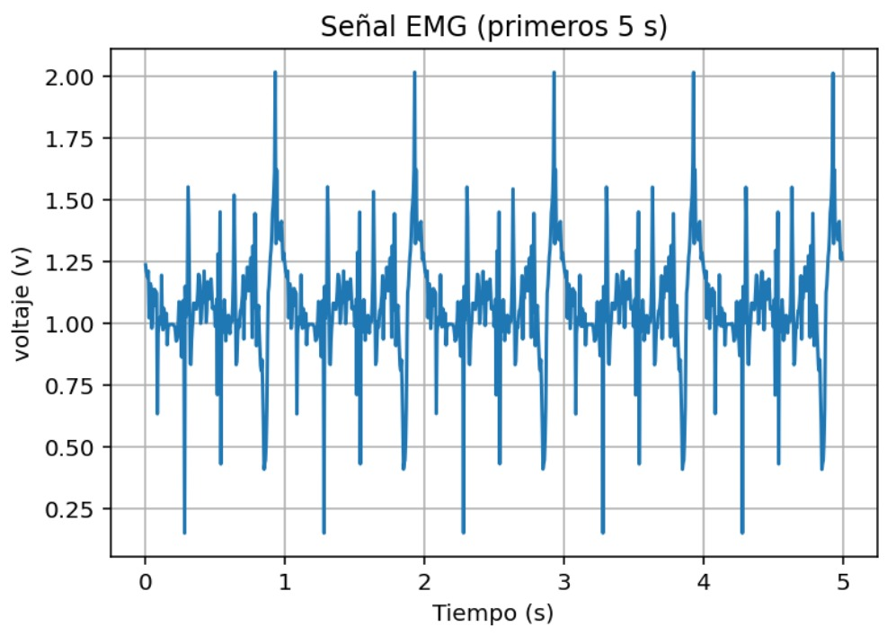
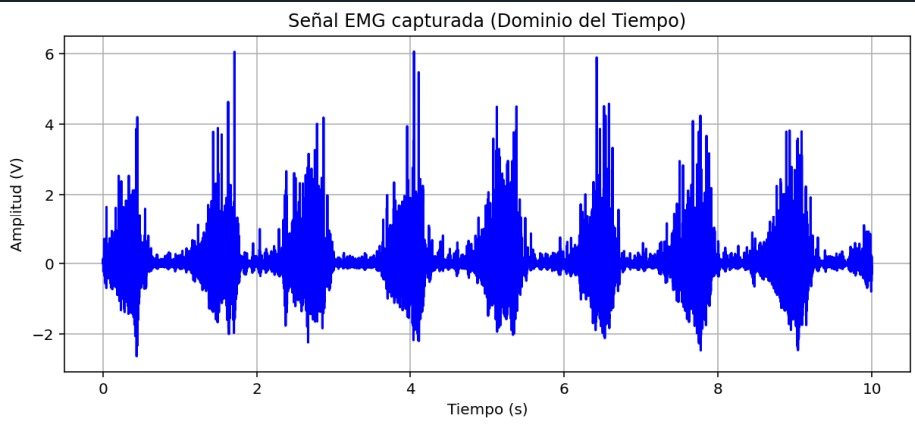
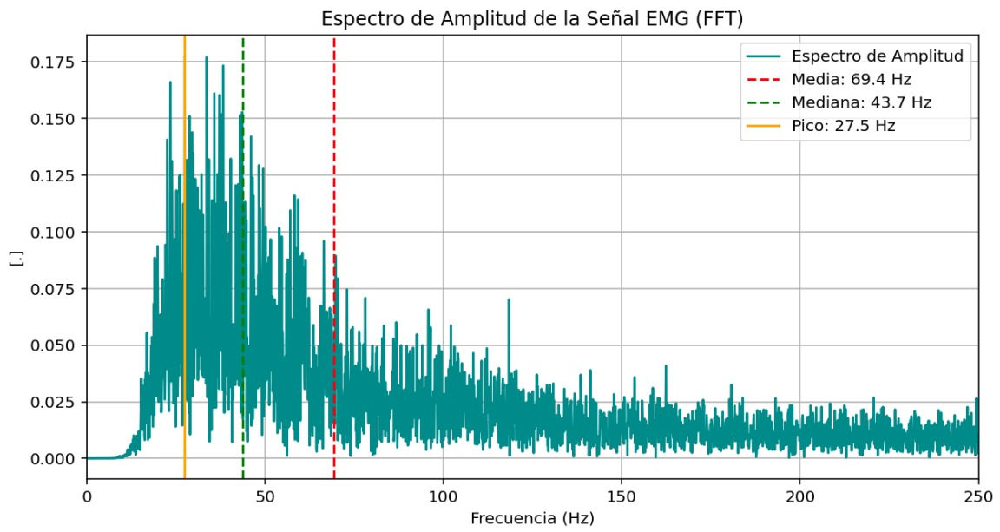
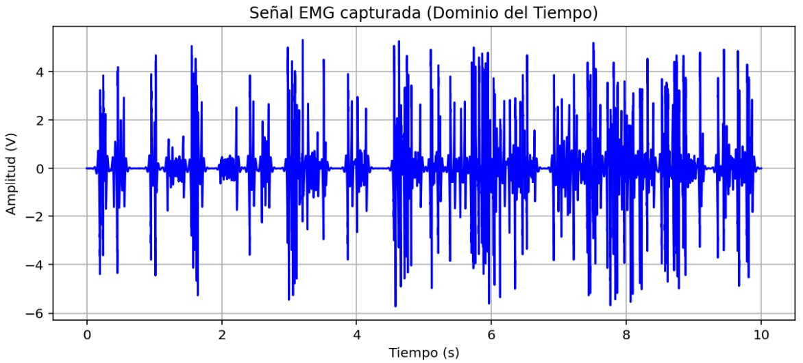
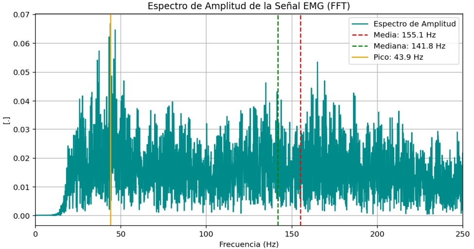

<div align="justify">
  
# Señales electromiográficas (EMG)
## Cuarto laboratorio de procesamiento digital de señales

**Maria Camila Ospina Jara, Juan Felipe Serna Alarcón**

## Descripción
Esta actividad consistió en la adquisición, acondicionamiento y procesamiento de señales electromiográficas. El propósito fue evaluar las variaciones en las características temporales y frecuenciales del músculo durante ejercicios controlados, utilizando tanto señales emuladas mediante un generador como señales reales capturadas de un voluntario. Se aplicaron técnicas de filtrado y segmentación para interpretar parámetros críticos como la frecuencia media y la frecuencia mediana
## Introducción
La fatiga muscular se define como la reducción de la capacidad del músculo para controlar cargas y mantener contracciones eficaces, fenómeno derivado de la acumulación de lactato y la disminución de adenosín trifosfato (ATP)
. Dado que un músculo fatigado presenta un mayor riesgo de lesiones, es fundamental su identificación objetiva
. En esta práctica, se utilizó la electromiografía de superficie (sEMG) como una técnica no invasiva para registrar la actividad eléctrica muscular
. El enfoque principal fue el empleo de herramientas de procesamiento digital de señales en los dominios del tiempo y la frecuencia para detectar cambios espectrales específicos que ocurren cuando el músculo alcanza el estado de fatiga

-------------------------------------------------------------------------------------------------------------------------
## Desarrollo de la práctica
### Parte A Captura y Análisis de Señal Emulada
En la primera fase, se utilizó un generador de señales biológicas configurado en modo EMG para simular cinco contracciones musculares voluntarias. Una vez adquirida la señal, se procedió a su segmentación para analizar cada contracción de forma individual. Se calcularon la frecuencia media y mediana para cada segmento, representando los resultados en tablas y gráficas de evolución. Esta etapa permitió observar cómo varían estos estadísticos en un entorno controlado antes de pasar a sujetos reales.
<p align="center">
  
</p>

### Resultados obtenidos  
##### Tabla de frecuencias por contracción
<div align="center">
  
|CONTRACCIÓN [-]     |FRECUENCIA MEDIA [Hz]     |FRECUENCIA MEDIANA [Hz]     |    
|:-----:|:-----:|:-----:|
|1     |254.95     |127.00     |     
|2     |255.56     |126.00     |          
|3     |253.80     |124.00     |          
|4     |251.23     |123.00     |          
|5     |249.48     |122.00     |                

</div>

##### Gráfica de la señal emulada por el generador de señales
<p align="center">
  
</p>

-------------------------------------------------------------------------------------------
### Parte B Captura de Señal Real y Detección de Fatiga
Se realizó la captura de señales sEMG reales colocando electrodos de superficie sobre un grupo muscular (como el bíceps o antebrazo) de un voluntario sano. El sujeto realizó contracciones repetidas hasta alcanzar la fatiga o la falla muscular. Para asegurar la calidad de la señal, se aplicó un filtro pasa-banda de 20 a 450 Hz, eliminando ruidos y artefactos. La señal se dividió por contracciones, calculando nuevamente la frecuencia media y mediana para analizar su tendencia decreciente a medida que progresaba el esfuerzo, relacionando estos cambios con la fisiología de la fatiga.
<p align="center">
  
</p>

### Resultados obtenidos  
##### Gráfica de la señal de contraccióne normal y su espectro de frecuencia
  
##### Gráfica de la señal de contracción en fatiga y su espectro de frecuencia
  

--------------------------------------------------------------------
### Parte C Análisis Espectral mediante FFT
Finalmente, se aplicó la Transformada Rápida de Fourier (FFT) a cada contracción de la señal real para obtener el espectro de amplitud. Al comparar los espectros de las primeras contracciones con los de las últimas, se pudo identificar visual y numéricamente la reducción del contenido de alta frecuencia y el desplazamiento del pico espectral hacia las bajas frecuencias. Este análisis confirmó la utilidad de la FFT como herramienta diagnóstica para monitorear el esfuerzo sostenido y la fatiga muscular de manera objetiva.

<p align="center">
  
</p>


### Análisis y discusión de resultados
- La fatiga muscular se produce principalmente por la acumulación de metabolitos como el lactato y la disminución de ATP, lo que reduce la capacidad del músculo para sostener contracciones eficientes.
En términos de señal sEMG, este fenómeno se refleja en la disminución del contenido de altas frecuencias, el desplazamiento del espectro hacia bajas frecuencias y la reducción progresiva de la frecuencia media y mediana. Lo cual ocurre debido a cambios en la velocidad de conducción de las fibras musculares y en el reclutamiento de unidades motoras.
- En la parte A se evidenciaron resultados clave como el correcto funcionamiento de la segmentación, un cálculo estable de frecuencia media y mediana y la ausencia de variaciones fisiológicas reales. Lo anterior permite estrablecer una base relativamente confiable, asegurando que cualquier variación posterior en señales reales se puede deber a fenómenos fisiológicos y no a errores en el procesamiento.
- En la parte B se evidenció la disminusión progresiva de la frecuencia media y de la frecuencia mediana. Estos cambios confirman la aparición de fatiga asociada a la disminución del ATP y a la reducción de la velocidad de conducción muscular. Además el filtro pasa-banda utilizado permitió eliminar en su mayoría ruido de movimiento (bajas frecuencias) e interferencias eléctricas (altas frecuencias).
- La trasformada rápida de fourier permotió analizar la distribución espectral de la señal
### Conclusiones
- La frecuencia media y la frecuencia mediana de la señal sEMG se validan como indicadores confiables de la fatiga muscular, evidenciando una disminución progresiva asociada a cambios metabólicos en el músculo.
- El análisis en el dominio de la frecuencia mediante la Transformada Rápida de Fourier (FFT) permite identificar de manera objetiva el desplazamiento espectral hacia bajas frecuencias, proporcionando información que no es observable en el dominio del tiempo.
- El filtrado pasa-banda (20–450 Hz) resulta fundamental para garantizar la calidad de la señal, al eliminar interferencias y artefactos que pueden distorsionar los indicadores frecuenciales.
- La comparación entre señales simuladas y reales confirma que las variaciones observadas en los datos experimentales corresponden a fenómenos fisiológicos y no a errores del procesamiento digital.
- La electromiografía de superficie (sEMG) se consolida como una herramienta eficaz y no invasiva para la detección de fatiga muscular, aunque su aplicación en entornos reales depende del control de ruido y de una adecuada instrumentación.
- En conjunto, los resultados demuestran que el procesamiento digital de señales aplicado a sEMG es una estrategia válida para el monitoreo del esfuerzo muscular y la prevención de lesiones en contextos clínicos y deportivos.
### Referencias


```python

```
|     |     |     |     |     |
|-----|-----|-----|-----|-----|
|     |     |     |     |     |
|     |     |     |     |     |
|     |     |     |     |     |
|     |     |     |     |     |
|     |     |     |     |     |
|     |     |     |     |     |


</div>
