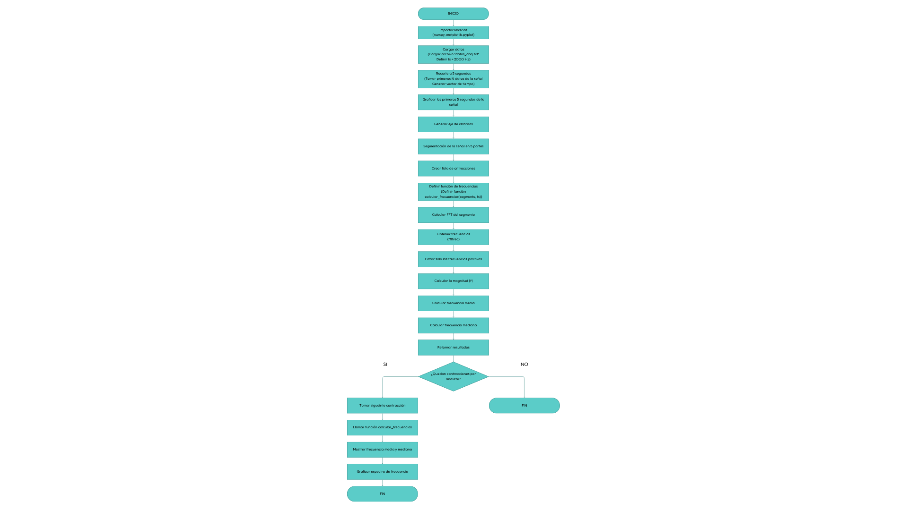
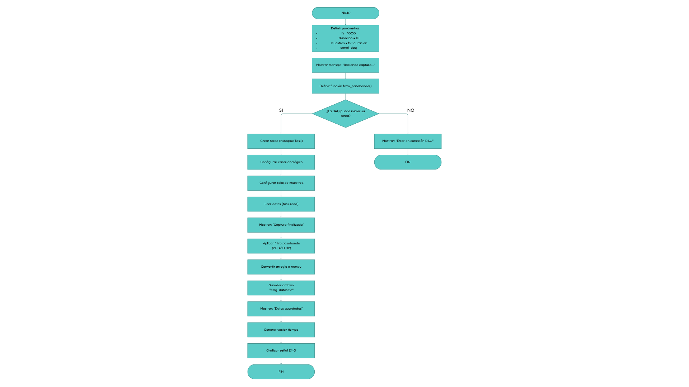
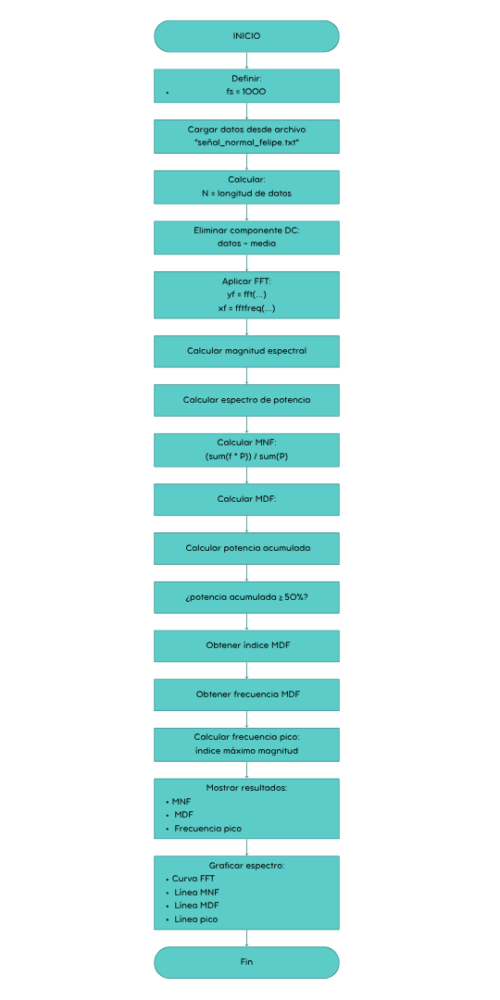

<div align="justify">
  
# Señales electromiográficas (EMG)
## Cuarto laboratorio de procesamiento digital de señales

**Maria Camila Ospina Jara, Juan Felipe Serna Alarcón**

## Descripción
Esta actividad consistió en la adquisición, acondicionamiento y procesamiento de señales electromiográficas. El propósito fue evaluar las variaciones en las características temporales y frecuenciales del músculo durante ejercicios controlados, utilizando tanto señales emuladas mediante un generador como señales reales capturadas de un voluntario. Se aplicaron técnicas de filtrado y segmentación para interpretar parámetros críticos como la frecuencia media y la frecuencia mediana
## Introducción
La fatiga muscular se define como la reducción de la capacidad del músculo para controlar cargas y mantener contracciones eficaces, fenómeno derivado de la acumulación de lactato y la disminución de adenosín trifosfato (ATP)
. Dado que un músculo fatigado presenta un mayor riesgo de lesiones, es fundamental su identificación objetiva
. En esta práctica, se utilizó la electromiografía de superficie (sEMG) como una técnica no invasiva para registrar la actividad eléctrica muscular
. El enfoque principal fue el empleo de herramientas de procesamiento digital de señales en los dominios del tiempo y la frecuencia para detectar cambios espectrales específicos que ocurren cuando el músculo alcanza el estado de fatiga
## Desarrollo de la práctica
### Parte A Captura y Análisis de Señal Emulada
En la primera fase, se utilizó un generador de señales biológicas configurado en modo EMG para simular cinco contracciones musculares voluntarias. Una vez adquirida la señal, se procedió a su segmentación para analizar cada contracción de forma individual. Se calcularon la frecuencia media y mediana para cada segmento, representando los resultados en tablas y gráficas de evolución. Esta etapa permitió observar cómo varían estos estadísticos en un entorno controlado antes de pasar a sujetos reales.
<p align="center">
  
</p>

### Parte B Captura de Señal Real y Detección de Fatiga
Se realizó la captura de señales sEMG reales colocando electrodos de superficie sobre un grupo muscular (como el bíceps o antebrazo) de un voluntario sano. El sujeto realizó contracciones repetidas hasta alcanzar la fatiga o la falla muscular. Para asegurar la calidad de la señal, se aplicó un filtro pasa-banda de 20 a 450 Hz, eliminando ruidos y artefactos. La señal se dividió por contracciones, calculando nuevamente la frecuencia media y mediana para analizar su tendencia decreciente a medida que progresaba el esfuerzo, relacionando estos cambios con la fisiología de la fatiga.
<p align="center">
  
</p>

### Parte C Análisis Espectral mediante FFT
Finalmente, se aplicó la Transformada Rápida de Fourier (FFT) a cada contracción de la señal real para obtener el espectro de amplitud. Al comparar los espectros de las primeras contracciones con los de las últimas, se pudo identificar visual y numéricamente la reducción del contenido de alta frecuencia y el desplazamiento del pico espectral hacia las bajas frecuencias. Este análisis confirmó la utilidad de la FFT como herramienta diagnóstica para monitorear el esfuerzo sostenido y la fatiga muscular de manera objetiva.

<p align="center">
  
</p>

### Análisis de resultados y conclusiones

### Referencias


```python

```
|     |     |     |     |     |
|-----|-----|-----|-----|-----|
|     |     |     |     |     |
|     |     |     |     |     |
|     |     |     |     |     |
|     |     |     |     |     |
|     |     |     |     |     |
|     |     |     |     |     |


</div>
